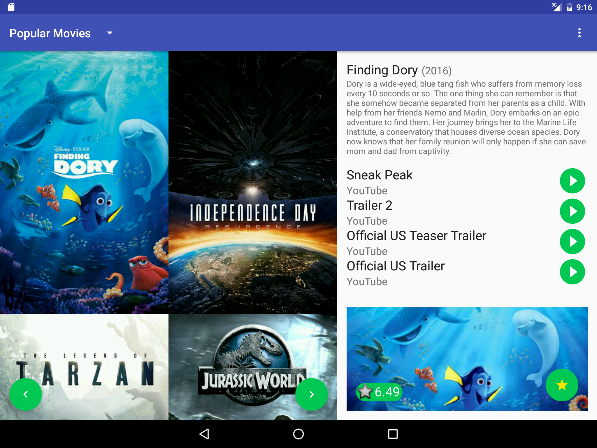

# Popular Movies

<p>To run the application an api key from www.themoviedb.org must
 be provided. A string item with the name of API_KEY in a resource file.
 for example:</p>
 - Create a resource file res/values/private_string.xml
 - Add the string like this:
 
```xml
<resources>
    <string name="API_KEY">your_api_key</string>
</resources>
```

## Screenshots

### Tablet
 

### Phone


> Created using Gson, Retrofit and the movie database themovie.org
